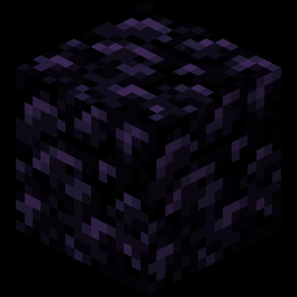

# Obsidian
It's my first chess engine. I'm just learning C++ and I really want to make an engine that plays very solid, impenetrable chess, therefore I call it Obsidian. 
I found MCTS interesting algorithm to try out.

